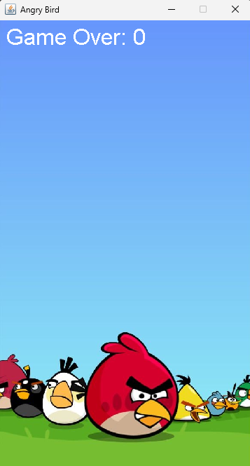

# Angry Bird Game

## Overview

Angry Bird is a 2D game inspired by Flappy Bird, developed using Java Swing and AWT. The player controls a bird and navigates it through a series of pipes by pressing the spacebar to keep the bird airborne. The objective is to score as high as possible by successfully passing through pipes without colliding.

## Features

- **Dynamic Gameplay:** Gravity pulls the bird down, and players can control its ascent by pressing the spacebar.
- **Random Pipe Generation:** Pipes appear at random heights, ensuring a unique experience each time.
- **Score Tracking:** The game displays the player's current score on the screen.
- **Game Over Screen:** Displays the final score when the bird collides with a pipe or falls off the screen.

## Requirements

- Java Development Kit (JDK) 8 or higher

## Installation

### Using Command Line

1. Clone the repository:
   ```bash
   git clone https://github.com/BhimUpd/Angry-Bird-Game---Java.git


<!DOCTYPE html>
<html lang="en">
<head>
    <meta charset="UTF-8">
    <meta name="viewport" content="width=device-width, initial-scale=1.0">
    <title>Game Demo</title>
</head>
<body>
    <h1>Game Background</h1>
    
    <h2>Game Demo Video</h2>
    <iframe width="560" height="315" src="https://www.youtube.com/embed/MyinfopnAPo" frameborder="0" allow="autoplay; encrypted-media" allowfullscreen></iframe>
</body>
</html>

